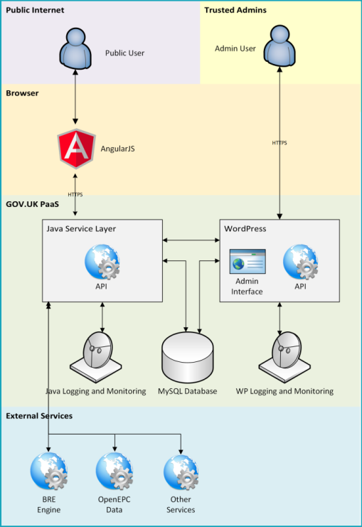

# BEIS DCEAS - Energy Efficiency Website

This project is the BEIS Energy Efficiency Website.

It is public-facing.

## Table of Contents

<!-- toc -->
TODO:RTB toc here
<!-- tocstop -->

## Architecture

## Development Setup

There are two web UIs: the user site (Angular JS) and the admin site (Wordpress).

To run and make changes to the user site (without making CMS changes), you will
need Java and Node.js. Follow the "Development Setup - User Site" section below.

To run and make changes to the admin site, or to make CMS changes to the user
site you will need PHP. Follow the "Development Setup - Admin Site" section below.

### Development Setup - User Site

You will need the database installed locally, follow
the "Development Setup - MySQL Database" section below.

TODO:RTB hopefully just press "play" in IntelliJ

TODO:RTB for now, you will need the WordPress site running locally as well

### Development Setup - Admin Site

You will need the database installed locally, follow
the "Development Setup - MySQL Database" section below.

You will need PHP installed and registered in IntelliJ.
You can install PHP using the Microsoft Web Platform Insaller at
https://www.iis.net/downloads/microsoft/web-platform-installer

Copy the file
`wordpress/wp-content/themes/angular-theme/config/config.php.template`
to a new file called `config.php` in the same directory and
fill in the config values. This file will be ignored by git, so
you can safely fill in the template values with real values.

You should be able to launch the site by selecting the "on local server"
run configuration and clicking "Play".

Open the site at http://localhost:81

### Development Setup - MySQL Database

Install MySQL 5.5 using the Microsoft Web Platform Insaller at
https://www.iis.net/downloads/microsoft/web-platform-installer

Set the root username and password to something
you will remember (e.g. "root" / "password").

Log in as root and run the following to create a WP user and database

    CREATE DATABASE wordpress;
    GRANT ALL PRIVILEGES ON wordpress.* TO "wordpress"@"localhost"
        IDENTIFIED BY "wordpressPassword123";

Get a dump of the database from somewhere (another developer,
the live site etc.) and restore it to that database.

# Older instructions - TODO:RTB sort out

## Angular setup

* Install Node.js and NPM https://nodejs.org/en/

* Open a cmd window and go to the "angular" directory in the root of the repository

* Run `npm install`

* Install the Angular CLI https://github.com/angular/angular-cli
  (technically not absolutely necessary, since NPM will
  install it locally - but it makes things easier)

* Run `ng build` to get the compiled Angular files into the Wordpress theme.
  The Angular application will now be available at http://localhost:81.

When developing, it's a good idea to have the command
"ng build --watch" running. This will watch your
Angular files and automatically compile them on changes.

## Tests

Angular unit tests are run from the Angular project. Open a command
window in "/angular" and run `ng test` (or "npm run test"). The
tests will automatically be re-run when the files are changed.

Integration tests are in the "/integration-tests" project.

* Go to /integration-tests and run `npm install`
* When you want to run the integration tests:
  * Have the site up and running at http://localhost:81
  * Run `npm run test`
    * If you are running the site at a different URL (e.g. if you're
      using EasyPHP), then either change exports.config.baseUrl in
      /integration-tests/protractor.conf.js to the correct baseUrl,
      or run "npm run test -- --baseUrl=[your base url]" instead

See http://www.protractortest.org/#/ for a guide on
writing protractor tests. We probably don't need too many
of these - just check that the site basically exists.

## Debugging

Go to https://www.jetbrains.com/help/idea/configuring-xdebug.html.
Download and install Xdebug, integrate it with the
PHP interpreter and do any IntelliJ config you need.

Create a debug server configuration following the instructions here
https://www.jetbrains.com/help/idea/creating-a-php-debug-server-configuration.html

Then just start debugging using this configuration!
